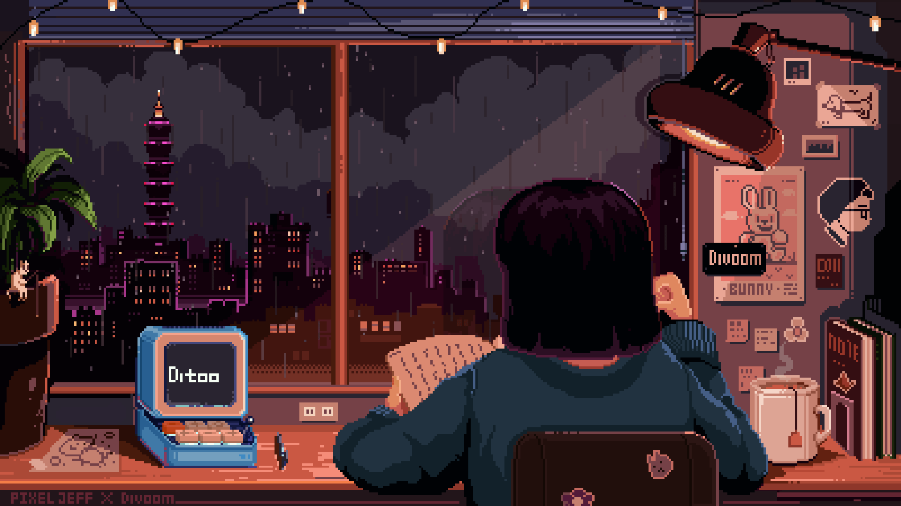

 Hiiii! I'm Hevellyn Mesquita, a Computer Engineer student at Federal University of Ceará (UFC) 🪼

  
  

#

<h3 align="left">My Stack ~</h3>

   
  
  
  
  
  
  
  
  

  
  
  
  
  
  
  
  

<picture align="center">
  <source media="(prefers-color-scheme: dark)" srcset="https://raw.githubusercontent.com/hevellyn16/hevellyn16/output/github-contribution-grid-snake-dark.svg">
  <source media="(prefers-color-scheme: light)" srcset="https://raw.githubusercontent.com/hevellyn16/hevellyn16/output/github-contribution-grid-snake-dark.svg">
  
</picture>

  <h4>
    
  </h4>
  

    
    
     
  

